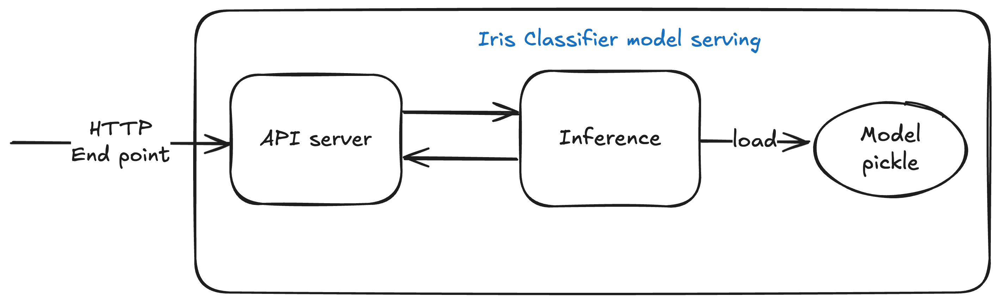

# Iris Classifier MLOps Project

An end-to-end MLOps implementation for the Iris flower classification model, 
demonstrating MLOps workflow for model training, serving using local envrionment 
and deploying the model through deployment pipeline.

## Project Overview

This project implements a simple machine learning pipeline for Iris flower classification 
with a focus on MLOps practices.




## Pre-requisites

In order to run model training or deploy serving application locally,
please ensure the follow setup in insalled on the host

- python 3.12>=
- docker or podman
- make  
- kubectl
- helm
- fluxcd

Before running any steps, plase ensure python virtual envionrment is initialized,
some setup is executed on the host

```bash
python -m venv venv && source venv/bin/activate
make setup
```


There are main loop developers or engineers would be following through the 
model SDLC(ML Ops)

 - Inner loop - Traing and test model locally, let iterate over model testing
 - Outer loop - Once model is ready to be deploy, developers would publish new 
 new model and deploy it through dev, staging and prod environment 

## Inner Loop

### Run model training

In order to run the model training, user could supply the sample
data through `./data/iris.csv` file. However do sample data 
provided system dump some sample data for common features 
of [Iris flower data sets](https://en.wikipedia.org/wiki/Iris_flower_data_set)

In order training model locally, execute

```bash
make training
......

Training ML model...
2025-05-08 17:12:47,887 - __main__ - INFO - Loading Iris dataset
2025-05-08 17:12:47,887 - __main__ - INFO - Loading data from data/iris.csv
2025-05-08 17:12:47,893 - __main__ - INFO - Building machine learning pipeline
2025-05-08 17:12:47,893 - __main__ - INFO - Training model...
2025-05-08 17:12:47,906 - __main__ - INFO - Model accuracy: 1.0000
2025-05-08 17:12:47,912 - __main__ - INFO - Classification report:
              precision    recall  f1-score   support

      setosa       1.00      1.00      1.00        10
  versicolor       1.00      1.00      1.00         9
   virginica       1.00      1.00      1.00        11

    accuracy                           1.00        30
   macro avg       1.00      1.00      1.00        30
weighted avg       1.00      1.00      1.00        30

2025-05-08 17:12:47,912 - __main__ - INFO - Saving model to artifacts/model_pipeline_1.0.20250508_171247.joblib
2025-05-08 17:12:47,913 - __main__ - INFO - Model training completed. Version: 1.0.20250508_171247
```
This training model store the training model under `artifacts` directory.

### Running model locally to test the model

In order to run the model locally, please execute

```bash
make run
```
This run the model serving service which serves some endpoints to 
test the model.

In order to test the model, either navigate to 
http://0.0.0.0:8000/docs#/default/predict_api_v1_predict_post
or run curl command, supply the sample input data

```json
//sample input for the test
{
    "sepal_length": 5.1,
    "sepal_width": 3.5,
    "petal_length": 1.4,
    "petal_width": 0.2   
}
```

```bash 
curl -X POST http://0.0.0.0:8000/api/v1/predict \                                    
  -H "Content-Type: application/json" \
  -d '{ "sepal_length": 5.1, "sepal_width": 3.5, "petal_length": 1.4, "petal_width": 0.2 }' \
| jq .
  
  
  % Total    % Received % Xferd  Average Speed   Time    Time     Time  Current
                                 Dload  Upload   Total   Spent    Left  Speed
100   327  100   214  100   113  60847  32129 --:--:-- --:--:-- --:--:--  106k
{
  "prediction": 0,
  "prediction_label": "setosa",
  "request_id": "af12c702-4bfb-49d6-b877-d3635d8c9092",
  "model_version": "1.0.20250508_171813",
  "probabilities": [
    0.9790426981632894,
    0.020957142708309617,
    1.591284009687682E-7
  ]
}
```

### Running the intgration tests

In order to run automated integration tests on trained model, 
please executethe following command on pretrained 
model from the previous steps

```bash
make test
```

## Outer Loop

### Paackge and run container

Before start deploying the model, one can run the model serving
app as a container by following command

```bash
make build-run
```

Accesr the model serving appllication at http://0.0.0.0:9000/docs

### Raise the Pull Request

Raise a pull request(PR) against the `main` branch. Upon
rasing the PR, automated workflow would run the model training
and integration test workflow. 
Publishes an image with PR build as suffix to the container tag.

### Build and publish model

Once ready to deploy the model, just create the git tag using 
https://github.com/hrishin/ml-ops/actions/workflows/tag.yaml
github action workflow.

This would allow user to either bump major, minor, patch or
user can pass the custom tag using [SEM VAR](https://semver.org/) 
schema.

Essentially this automated workflow will tag the source 
latest commit on the main branch, build and publish the 
seving container image to the`docker.io/hrishi/ml-ops` 
repository using https://github.com/hrishin/ml-ops/actions/workflows/build-helm.yaml
workflow.

The model version is maintained using the the 
same tagging version

### Deploy model serving service

To deploy the container image that is
built using from the previous step,
navigate to https://github.com/hrishin/ml-ops/actions/workflows/deploy-service.yml
workflow, just pass the image tag.

Imaage tag is going to be the same as git 
tag from the preivous steps.

One can look at https://github.com/hrishin/ml-ops/actions/workflows/tag.yaml
get the tag from the workflow summery.

The deploy workflow deploys the model serving application using 
gitops workflow by allows promoting deployment from dev, staging and 
prod environment.

This deploy the application on Kubernetes cluster. Make sure respective 
Kubernets clusters are configure to use the gitops workflow using the fluxcd
by following one time setup described in #gitops-setup section.

## Gitops setup

In order to orchestrate the application deployment, dependent 
infrastrucure, this demo uses fluxCD as one of the deployment tools.

General idea of Gitops is to use git as a source of truth for deployment
configuration let fluxcd kind of tools orchestrate the reoncillation
to rallise the deployment configuration and make change into the deployment
states of the system.

Use one of the command to initilize the gitops setup to respective kubernetes clusters
In this instance following commands bootstrap flux with the this gitops repository
for the `development` environment.

Note: Before running the setup comamnd make sure you have installed the fluxcd CLI,
get the github [PAT(Personal Account Token)](https://docs.github.com/en/authentication/keeping-your-account-and-data-secure/managing-your-personal-access-tokens) 
which has permission to read the github repo.
Export the following environment variables

GITHUB_TOKEN=PAT,

GITHUB_USER=your-github-username,

GITHUB_REPO=your fork repo or this repo URL

```bash
flux bootstrap github \                                                 
    --owner=${GITHUB_USER} \
    --repository=${GITHUB_REPO} \
    --branch=main \
    --personal \
    --path=deployment/clusters/dev
```

Run the similar commands to `staging` and `production` clusters by change the argument
 `--path` to `deployment/clusters/stage`, `deployment/clusters/prod` respectively.
