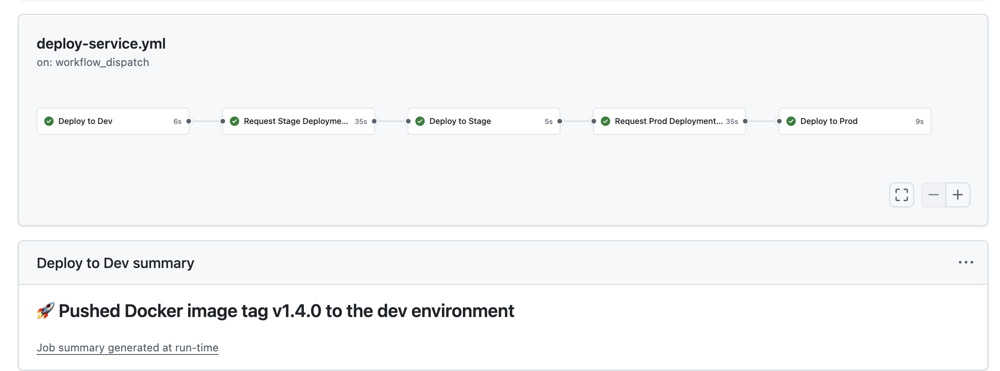

# Iris Classifier MLOps Project

An end-to-end MLOps implementation for the Iris flower classification model, 
demonstrating the MLOps workflow for model training, serving using a local environment, 
and deploying the model through a deployment pipeline.

## Project Overview

This project implements a simple machine learning pipeline for Iris flower classification 
with a focus on MLOps practices.


## Pre-requisites

In order to run model training or deploy the serving application locally,
please ensure the following setup is installed on the host:

- Python - 3.12 >=
- Docker or Podman
- Make  
- Kubectl cli
- Helm cli
- Flux cli - v2.5.1 >=
- Kind cli - v0.27.0 >=

Before running any steps, please ensure the Python virtual environment is initialized,
and the necessary setup is executed on the host:

```bash
python -m venv venv && source venv/bin/activate
make setup
```

There are two main loops that developers or engineers would be following through the 
model SDLC (ML Ops):

- Development loop - Train and test the model locally, iterate over model testing
- Deployment loop - Once the model is ready to be deployed, developers would publish the new 
  model and deploy it through dev, staging, and prod environments

## Development Loop

### Run model training

In order to run the model training, the user can supply the sample
data through `./data/iris.csv` file. However, if no sample data is provided, the system will dump some sample data for common features 
of the [Iris flower data set](https://en.wikipedia.org/wiki/Iris_flower_data_set).

To train the model locally, execute:

```bash
make training
......

Training ML model...
2025-05-08 17:12:47,887 - __main__ - INFO - Loading Iris dataset
2025-05-08 17:12:47,887 - __main__ - INFO - Loading data from data/iris.csv
2025-05-08 17:12:47,893 - __main__ - INFO - Building machine learning pipeline
2025-05-08 17:12:47,893 - __main__ - INFO - Training model...
2025-05-08 17:12:47,906 - __main__ - INFO - Model accuracy: 1.0000
2025-05-08 17:12:47,912 - __main__ - INFO - Classification report:
              precision    recall  f1-score   support

      setosa       1.00      1.00      1.00        10
  versicolor       1.00      1.00      1.00         9
   virginica       1.00      1.00      1.00        11

    accuracy                           1.00        30
   macro avg       1.00      1.00      1.00        30
weighted avg       1.00      1.00      1.00        30

2025-05-08 17:12:47,912 - __main__ - INFO - Saving model to artifacts/model_pipeline_1.0.20250508_171247.joblib
2025-05-08 17:12:47,913 - __main__ - INFO - Model training completed. Version: 1.0.20250508_171247
```
This training model stores the trained model under the `artifacts` directory.

### Running the model locally to test the model

To run the model locally, execute:

```bash
make run
```

This runs the model serving service which serves some endpoints to 
test the model.

To test the model, either navigate to 
http://0.0.0.0:8000/docs#/default/predict_api_v1_predict_post
or run a curl command to supply the sample input data:

```json
//sample input for the test
{
    "sepal_length": 5.1,
    "sepal_width": 3.5,
    "petal_length": 1.4,
    "petal_width": 0.2   
}
```

```bash 
curl -X POST http://0.0.0.0:8000/api/v1/predict \                                    
  -H "Content-Type: application/json"   -d '{ "sepal_length": 5.1, "sepal_width": 3.5, "petal_length": 1.4, "petal_width": 0.2 }' | jq .
```

Response 

```bash
{
  "prediction": 0,
  "prediction_label": "setosa",
  "request_id": "af12c702-4bfb-49d6-b877-d3635d8c9092",
  "model_version": "1.0.20250508_171813",
  "probabilities": [
    0.9790426981632894,
    0.020957142708309617,
    1.591284009687682E-7
  ]
}
```

### Running the integration tests

To run automated integration tests on the trained model, 
please execute the following command on the pretrained 
model from the previous steps:

```bash
make test
```

## Deployment Loop

### Package and run container

Before starting the deployment of the model, one can run the model serving
app as a container by using the following command:

```bash
make build-run
```

Access the model serving application at http://0.0.0.0:9000/docs

### Raise the Pull Request

Raise a pull request (PR) against the `main` branch. Upon
raising the PR, the automated workflow will run the model training
and integration test workflow, and 
publish an image with the PR build as a suffix to the container tag.

### Build and publish the model

Once the model is ready to deploy, just create the git tag using 
[Tag code](https://github.com/hrishin/ml-ops/actions/workflows/tag.yaml)
GitHub Action workflow.
This workflow allow the user to either bump major, minor, patch, or
pass a custom tag using [SEMVER](https://semver.org/) 
schema.

This automated workflow will tag the latest commit on the `main` branch, build, and publish the 
serving container image to the `docker.io/hriships/ml-ops` 
repository using the [Build model and publish container image](https://github.com/hrishin/ml-ops/actions/workflows/build-container.yaml)
workflow.

The model version is maintained using the same git tagging version.

### Deploy model serving service

To deploy the container image that was
built from the previous step,
navigate to [Deploy serving service](https://github.com/hrishin/ml-ops/actions/workflows/deploy-service.yml) 
workflow and pass the image tag.



The image tag will be the same as the git 
tag from the previous build steps that has been executed earlier.
One can check [Tag code](https://github.com/hrishin/ml-ops/actions/workflows/tag.yaml) or 
[Build model and publish container image](https://github.com/hrishin/ml-ops/actions/workflows/build-container.yaml) to get the tag from the workflow summary.

The deploy workflow deploys the model serving application using
GitOps, allowing deployment promotion through dev, staging, and 
prod environments.

This will deploy the application on the Kubernetes cluster. Make sure the respective 
Kubernetes clusters are configured to use the GitOps workflow using FluxCD
by following the one-time setup described in the [GitOps setup](#gitops-setup) section.
One can setup the local `development` cluster by following [Local cluster setup](#local-cluster-setup) guide.

Run the following flux command to sync 
the changes to cluster from the github repository

`Note: make sure kubectl is configured to use the current cluster from dev, stage and prod`

```bash
flux reconcile source git flux-system
flux get hr -n ml-ops #to follow the status

#or

flux reconcile hr iris-classifier -n ml-ops #to reconcile the state manually
```

Access the model endpoint by following 

```bash
 curl -X POST -H "Host: iris.kube.two.inc" -H "Content-Type: application/json" \
  http://iris.kube.two.inc/api/v1/predict \
  -d '{ "sepal_length": 5.1, "sepal_width": 3.5, "petal_length": 1.4, "petal_width": 0.2 }' | jq .

{
  "prediction": 0,
  "prediction_label": "setosa",
  "request_id": "bfff066d-7900-4793-838c-5593b0701ec4",
  "model_version": "1.0.20250508_134800",
  "probabilities": [
    0.9790426981632894,
    0.020957142708309565,
    1.591284009687682E-7
  ]
}
```

## GitOps setup

In order to orchestrate the application deployment and dependent 
infrastructure, this demo uses FluxCD as one of the deployment tools.

The general idea of GitOps is to use git as a source of truth for deployment
configuration, letting FluxCD or similar tools orchestrate the reconciliation
to realize the deployment configuration and manage changes in the deployment
state of the system.

Use one of the commands to initialize the GitOps setup for the respective Kubernetes clusters.
In this case, the following commands bootstrap FluxCD with this GitOps repository
for the `development` environment.

```
Note: Before running the setup command, make sure you have installed the FluxCD CLI,
and obtain the GitHub [PAT (Personal Access Token)](https://docs.github.com/en/authentication/keeping-your-account-and-data-secure/managing-your-personal-access-tokens), 
which has permission to read/write from/to the GitHub repo.
```

Export the following environment variables:

GITHUB_TOKEN=PAT,

GITHUB_USER=your-github-username,

GITHUB_REPO=your-forked-repo-or-this-repo-name

```bash
flux bootstrap github \
  --owner=${GITHUB_USER} \
  --repository=${GITHUB_REPO} \
  --branch=main \
  --personal \
  --path=deployment/clusters/dev
```

Run the similar commands for the `staging` and `production` clusters by changing the `--path` argument to `deployment/clusters/stage` and `deployment/clusters/prod`, respectively.

## Deploy application using locally

There may be a scenarios where user may want to deploy the application on manually
on the kubernetes cluster.
Either this cluster could run remote or locally.

Application packaging is done through Helm Chart, which is one of the ways
to deploy application on Kubernetes.

In this case, a [helm chart](./charts/iris-classifier) for this application can be used to deploy the application by executing following commands.

```bash
make install 
```

Once done testing, tear down the cluster which was setup locally in the previous step

```bash
kind delete cluster --name demo-cluster
```

## Publish the new helm chart version

Application hosts the a [helm chart](./charts/iris-classifier) using the [github pages](https://hrishin.github.io/ml-ops/). Ops engineer
or developer can build build and publish the new version of chart using
https://github.com/hrishin/ml-ops/actions/workflows/build-helm.yaml workflow


## Operations

System deploys built-in grafana dashboard visualize the timeseries metrics 
which could help both SRE and developers to troubleshoot root cause of certain behavior. 
Users could access ready to use `Iris Model Serving` dashboard

http://grafana.kube.two.inc/dashboards

# Local cluster setup

To deploy application on local Kubernetes cluster(optional), execute 
the following script

```bash
./scripts/kind.sh
```

In order to access applications deployed though the kind 
cluster, add following entires in the host file

```sh
127.0.0.1       iris.kube.two.inc
127.0.0.1	      prometheus.kube.two.inc
127.0.0.1       grafana.kube.two.inc
```

* Linux/Mac: edit `/etc/hosts`
* Windows: edit `C:\Windows\System32\drivers\etc\hosts`

Note: editing host files needs Super user or administrator access


## References

- Model training code was referred through https://claude.ai