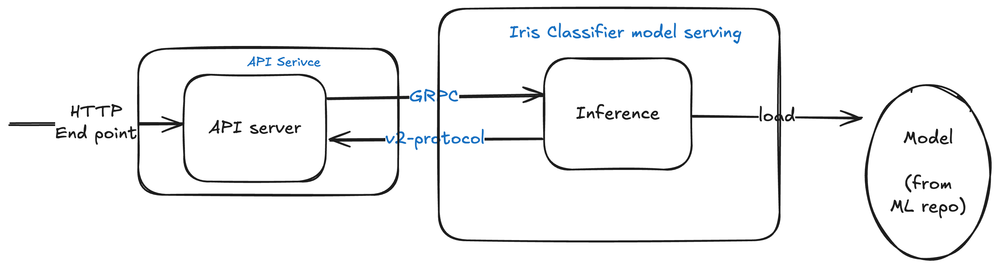

# Architecture Design Decision(ADR)

A document to capture the design decisions about the applications,
training, deployment and operations

## Monolith design

Python based serving model uses the FastAPI to load and sever the model. 
Application assumes model and metadata is available in designated location 
on the file system, thus it tries to load from system.
As not application is monolith by design which packages the application source
and model together through a container image given the size of the model.
Also, simplifies the iteration and operation aspects of service.

Though application expose `api/v1/model/info` get model information. The `api/v1/health`
endpoint expose health of the service which given the information about if 
model has been loaded successfully or not.

## Model training and versioning

Once model is ready to be publish, user leverages git tags. Which triggers 
automated [build flow](https://github.com/hrishin/ml-ops/actions/workflows/build-helm.yaml) to train the model, package model and service as container image. Git tag is serves source of truth for model versioning 
and container image tag.

This allows use git to version control the releases, make release notes and build automation workflow thus simplifies overall model versioning

As of now model is trained through the the github action workflow pipeline, however same pipeline could be enhanced to build and deploy model
to extenal model repository.

## Deployment through helm and GitOPs

A helm chart is used to package the application manifests and to expose the certain configuration for the user configure the application.
This chart for this application is designed in very opinionated way so 
that entry barrier to deploy the containerized application on Kubernetes 
could be simplified to quite a good degree.


Helm act as abstract on hide the implementation details, so incase tomorrow platform team decides to move from `deployment` to `statefulsets`
workload objects, end users wont need understand the implementation details


Current implementation use the FluxCD to deploy both iris classifier model 
service and some dependent infra. such as nginx-ingress, prometheus,
grafana.
FluxCD allows modeling gitiops workflow and gives effect pattern quite conveniently using helm and kustomization configurations in order to deploy both infra. components and services. FluxCD is 
easy to operate and govern comparatively other GitOPs tools like ArgoCD.

For this service, following is the layout used to deployment
```bash
.
├── applications # holds all application manifests for both infra and application
│   ├── iris
│   │   ├── v1.0.0+v1
│   │   │   ├── kustomization.yaml
│   │   │   ├── release.yaml
│   │   │   └── repo.yaml
│   │   └── v1.2.0+v1 # holds the common configuration for the application 
│   │       ├── kustomization.yaml
│   │       ├── release.yaml
│   │       └── repo.yaml
│   ├── kube-prometheus
│   │   ├── v72.0.0-v1
│   │   │   ├── helm-release.yaml
│   │   │   ├── kustomization.yaml
│   │   │   └── repo.yaml
│   │   └── v72.0.0-v2
│   │       ├── dashboard-cm.yaml
│   │       ├── helm-release.yaml
│   │       ├── kustomization.yaml
│   │       └── repo.yaml
│   ├── namespace
│   │   └── v1
│   │       ├── kustomization.yaml
│   │       ├── namespace.yaml
│   │       └── rbac.yaml
│   └── nginx
│       └── v4.12.2-v1
│           ├── helm-release.yaml
│           ├── kustomization.yaml
│           └── repo.yaml
├── clusters #this holds cluster specific deployment(entry point)
│   ├── dev
│   │   ├── app.yaml #app has dependency on infra, infra has to be in place beforehand
│   │   ├── infra.yaml
│   │   └── kustomization.yaml
│   ├── prod
│   │   ├── app.yaml
│   │   ├── infra.yaml
│   │   └── kustomization.yaml
│   └── stage
│       ├── app.yaml
│       ├── infra.yaml
│       └── kustomization.yaml
└── overlays #Use kustomization to configure environment specific options for each application
    ├── dev
    │   ├── apps
    │   │   ├── kustomization.yaml
    │   │   └── values.yaml
    │   └── infra
    │       ├── ingress
    │       │   └── kustomization.yaml
    │       ├── kustomization.yaml
    │       └── monitoring
    │           └── kustomization.yaml
    ├── prod
    │   ├── apps
    │   │   ├── kustomization.yaml
    │   │   └── values.yaml
    │   └── infra
    │       ├── ingress
    │       │   └── kustomization.yaml
    │       ├── kustomization.yaml
    │       └── monitoring
    │           └── kustomization.yaml
    └── stage
        ├── apps
        │   ├── kustomization.yaml
        │   └── values.yaml
        └── infra
            ├── ingress
            │   └── kustomization.yaml
            ├── kustomization.yaml
            └── monitoring
                └── kustomization.yaml

```

Cons with the fluxcd is quite CLI tailored compare to web UI,
Users may need to learn more about Flux CLI commands in order to govern
the deployment operations.


## Monitoring and service reliability

The model serving application exposes important some important prometheus 
format metrics about python runtime, model serving and API endpoints.


These metrics could be used to govern service reliability
- Establish the SLA/SLO form the SRE perspective, right alerts could be deployed to preventing and intervene service outage
- Grafana dashboard to visualize the timeseries metrics which could help both SRE and developers to troubleshoot root cause of certain behavior.


Right sizing the workload and scaling the service is important aspect of service reliability. As of now system allows scaling the service manually by adding more replicas to services.
However some notes are capture for the future work from scalability aspect.

## Mono repo

As of now application, helm chart, deployment configurations all lives in one repo to simplify exercise submission for the pragmatic purpose.
For deploying clusters, infra components, charts definitions could still be
hosted into the monorepo.
Mono repository usually reduced the overhead over managing multiple repository. It also facilitate building common operations conveniently.
On the trade it raise some challenges with administration and logistics such as networking payload during the cloning, or encountering merge conflicts during the common GitOPs operations etc.

However application specific deployment and build workflows could live into its own git repository.

## Future Scope

### Splitting the service into model and API services

Following scenarios could be potential reason to refactor service
design, to split services into model serving and API service

- Multi model inference serving where inference would be coming from 
result of more than one model
- A/B testing model and based on accuracy promoting the model with higher
weight 
- If model size grows large, demands its own way building and deploying the 
mode service then distinct model service would allow packing and rolling out the
models more effectively
- Scaling of model serving 

On the trade-off side having such design gong to add some degree of operation
overheads from software SDLC, deployment and readability aspects

One of the proposed solutions for such a case is to use [
Seldon MLServer](https://www.seldon.io/solutions/seldon-mlserver/), which allows 
running multiple models, supports Scikit-Learn, 
exposes model metrics/Grafana dashboards, and integrates well with 
[Seldon Core](https://github.com/SeldonIO/seldon-core/), providing a Kubernetes-native 
way of deploying models via an external model repository.



### Deployment workflow

As of now deployment pipeline doesn't provide a way to acknowledge the status
of deployment. 
In future pipeline can well integrate with the cluster and fluxcd to 
retrieve the status of deployment.
Another possible solution is to replace flux with ArgoCD which give the UI
application that could enhance the end user experience.

### Add Kubernetes provisioning scripts for GKE/EKS

As of system assumes the deployable clusters are provisioned through
SRE/Platform engineering team. 
May system can give a way to provision the cluster with the essential infrastructure
from Kubernetes clusters, Core networking, computer and storage resources.

### API service enhancement

In the current context API service ignore important aspect of of security
such as securing endpoint through Oauth, JWT or Bearer token based authentication.
In need to add the authentication.

Scaling, right now service doesn't auto-scale itself. However it exposes important metrics
which could be leveraged autoscale serving using HPA or Keda kind of services.

### Improve overall services accessability

As of some of services not really configured well to access it through the well formed URL or through the ingress URL.
One of the important enhancement provided well formed URL to access these services.

### Security

Some of the infa. services(grafana) needs right way of initializing the credentials. In the real scenarios, all such credentials would be either secured in the git configuration or would be stored in secure secrete value services.
